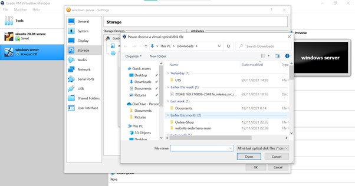
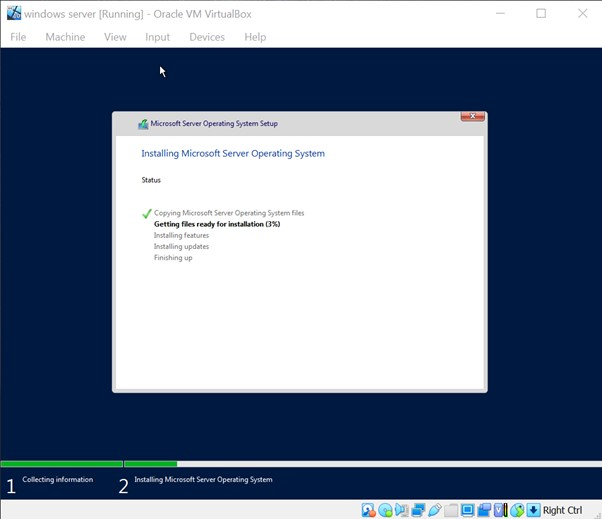
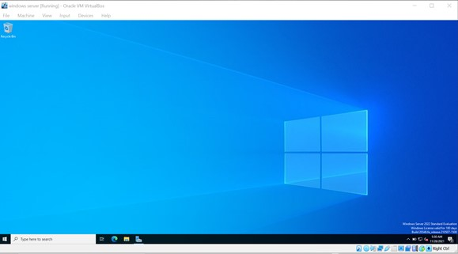

# UTS Server Administration System - Laporan Instalasi Windows Server 2022

### Report by :

Rahmadina Oktaviana (1202190016)
___

Berikut soal UTS Sistem Administrasi Server :

Soal UTS dapat diaskes [disini.](https://yptorid-my.sharepoint.com/:w:/g/personal/aldo_ittelkom-sby_ac_id/EahwnD4AudVAqCDtSDN9JVsBTLMMU-hBAnMwq-2TthH9dA?e=gpexdw)

## Installation windows server 2022
---
### 1. Download ISO windows server 2022

- Berikut link untuk mendownload windows server 2022

    https://www.microsoft.com/en-us/evalcenter/evaluate-windows-server-2022
        
    - Download ISO windows server 2022

        
    
### 2. Open virtualbox untuk langkah awal instalasi pada virtualbox
    
- Create new virtual machine for windows server 2022

    

- Create name for virtual machine

    

- Setting RAM Virtual Machine

    
    
- Create Hard Disk
    
    
    
- Setting Hard Disk file type
    
    

- Setting storage on physical hard disk

    
    
- Setting location and size of Disk
    
    

- Hasil create virtual machine

    

### 3. Setting storage untuk select file windows server dan setting network 

- Setting storage

    

    

    

- Setting network

    
    

### 4. Open virtual machine

- Start virtual machine windows server 2022

    

- Instalasi wizzard windows server 2022

    

- Install windows server 2022

    

    - Select windows server 2022 desktop experience  
            
        

    - Accept license terms
            
        

    - Select install microsoft server advanced
            
        

    - Location installation of windows server 2022

         

    - Installing Microsoft Server Operating System

         

    - Create password 

         
    
    - Screen display lock desktop windows server 2022

         

    - Acsess the menu "Input "ctrl + alt + del" then enter the password created and wait for the configuration to load 

         
    
    - Go to the menu "Devices - Insert Guest Additions CD Image" 

         

         

         

    - Choose Install location

         

    - Choose Components

         

    - Install and reboot the machine then enter the password

         

         

    - Hasil

         

    - Windows server 2022 berhasil di install

         

